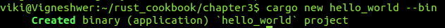
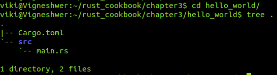
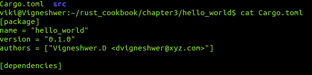
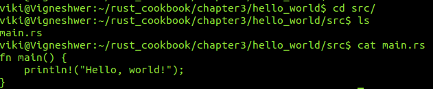
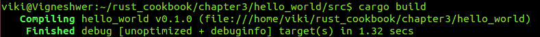
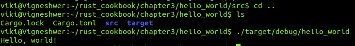
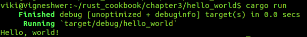
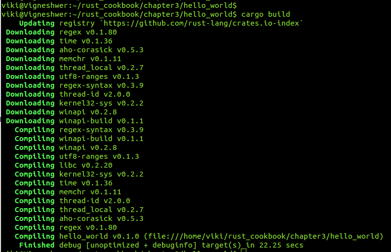
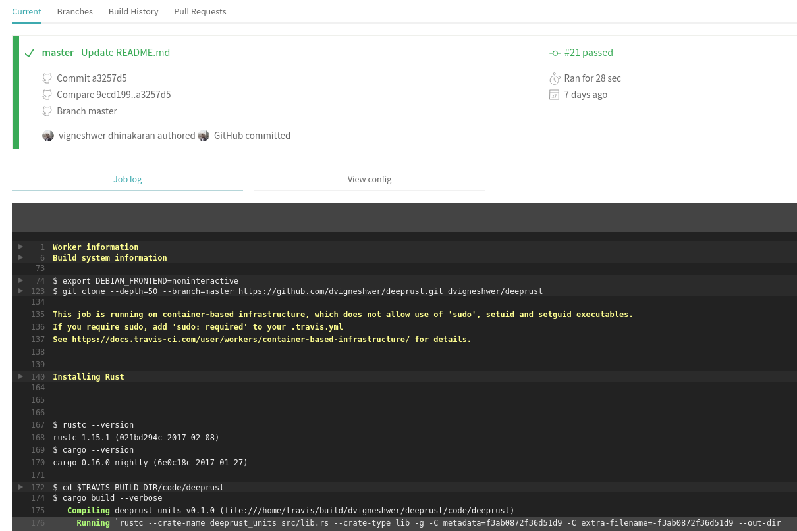

# Exploring cargo features

## Creating a new project

Commands
========

Follow the below steps in the terminal: 

~~~~
cd project_location

// incase of binary project
cargo new project_name --bin

// Library project 
cargo new project_name 

cd project_name 

tree .

cd src 

cat cargo.toml

cat main.rs 

cargo build 

./target/debug/project_name
~~~~

Output: 
=======

## Installing a new package

~~~~
nano Cargo.toml

// Enter the library detail in the dependencies field 

[dependencies]
time = "0.1.12"
regex = "0.1.41"
rand = { git = "https://github.com/rust-lang-nursery/rand.git", rev = "9f35b8e" }

or 

cargo add package_name
~~~

Output:
=======

## Testing with Cargo 

~~~~
// Running all the test file 
cargo test

// Running a specific file 
cargo test test_name
~~~~

## Building projects on Travis CI 

~~~~
touch .travis.yml

// Copy paste the code 

language: rust
rust:
- stable
- beta
- nightly
matrix:
allow_failures:
- rust: nightly

~~~~

Output:
=======

## Uploading to Crates.io 

~~~~
// Go to https://cargo.io

cargo login API_token
cargo package
cargo publish

// API Token in stored here 
~/.cargo/config 
// Keep it safe 

*.crate file 

[package]
# ...
exclude = [
"public/assets/*",
"videos/*",
]
# ...
include = [
"**/*.rs",
"Cargo.toml",
]

~~~~

